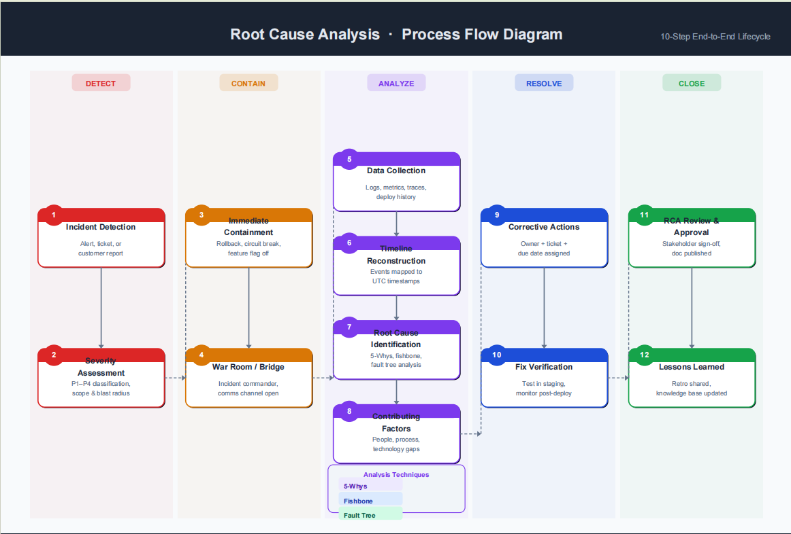

# Root Cause Analysis (RCA)
Root Cause Analysis (RCA) is a systematic problem-solving process used to identify the fundamental, underlying causes of a fault or issue.

# Process flow of Root Cause Analysis (RCA)

Each card shows the step number, title, and subtitle description. Arrows show the flow within and between phases, with an Analysis Techniques callout (5-Whys, Fishbone, Fault Tree) anchored to the ANALYZE column. Phase legend at the bottom, confidentiality footer included.

#  Root Cause Analysis (RCA) Reporting Document Format
[Open Document](<RCA_Report.docx>)
