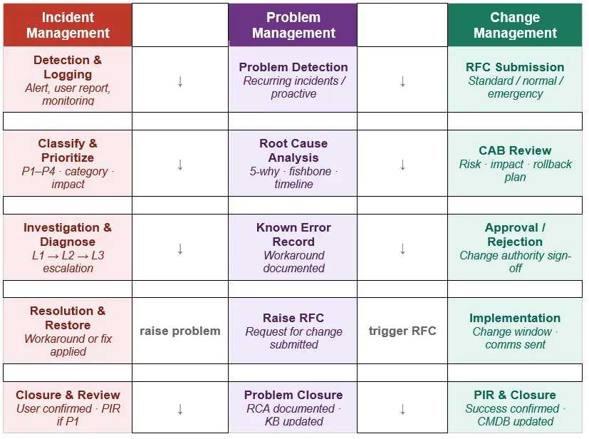
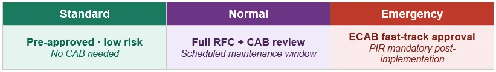

# Incident management, Problem management and Change management workflow

The three ITSM disciplines are interconnected. Incidents trigger Problems when recurring; Problems raise RFCs to permanently fix root causes; Change Management gates all fixes through a controlled approval process.

# How the Three Processes Connect
• Incident management is reactive — restore service as fast as possible.

Become a Medium member
• When a P1 closes, or when the same incident recurs, raise a Problem record.

• Problem management is investigative — find the root cause, document a known error with a workaround.

• Once a permanent fix exists, raise an RFC (Request for Change) to implement it safely.

Change management is the governance gate that prevents uncontrolled fixes from causing new incidents.

# Change Types

